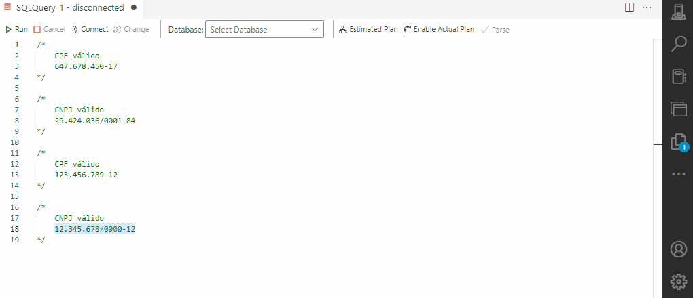

# CPF / CNPJ Azure Data Studio Extension
Extensão para Azure Data Studio com o objetivo de trabalhar com CPF e CNPJ.

## Funcionalidades
Possui as seguintes funcionalidades ao selecionar um texto no editor de queries:

1. Remove formatação de documentos (F3);
2. Adiciona formatação de documentos (Ctrl+F3);
3. Durante estas operações, também é feita uma validação utilizando a lib [cpf-cnpj-validator](https://github.com/carvalhoviniciusluiz/cpf-cnpj-validator)

## Demonstração

## Instalação

A última versão está disponível em [Releases](https://github.com/educroch/cpf-cnpj-ads-extension/releases) do repositório deste projeto. 

Faça o download do arquivo VSIX, relativo à versão desejada e use a opção ***Install from VSIX..*** do menu de Extensões do Azure Data Studio.

## Contribuidores

* Eduardo Cogo da Rocha [GitHub](https://github.com/educroch) | 

## Licença

[MIT](http://opensource.org/licenses/MIT)
